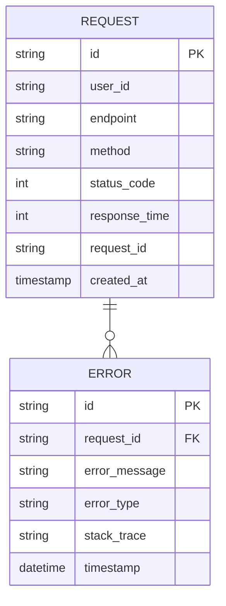

# API Gateway

## Зона ответственности
API Gateway — это центральная точка входа для всех запросов, поступающих от фронта. Он отвечает за аутентификацию, маршрутизацию запросов к соответствующим сервисам и агрегацию ответов.

## Основные задачи
- Прием HTTP-запросов от фронта
- Аутентификация и валидация входящих запросов
- Логирование запросов и ошибок
- Сбор и хранение статистических данных по вызовам API

## Границы сервиса
- API не содержит бизнес-логику приложения
- Не занимается постоянным хранением пользовательских или бизнес-данны

## ER-диаграмма

