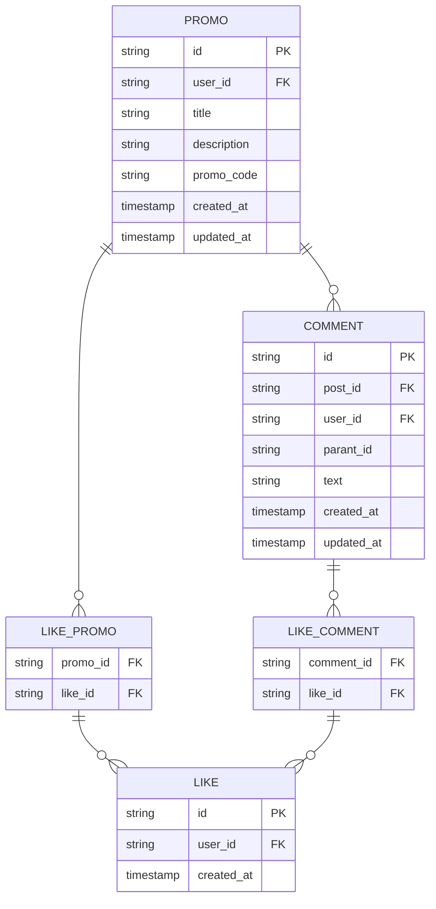

# Сервис промо

## Зона ответственности
Сервис постов отвечает за создание, хранение и управление промокодами и комментариями

## Основные задачи
- Создание и обновление промокодов/комментариев
- Управление комментариями, включая вложенные ответы
- Обеспечение фильтрации и поиска предложений

## Границы сервиса
- Не занимается аутентификацией и управлением учетными записями пользователей
- Не обрабатывает статистику просмотров, лайков или комментариев — это зона сервиса аналитики

## ER-диаграмма

