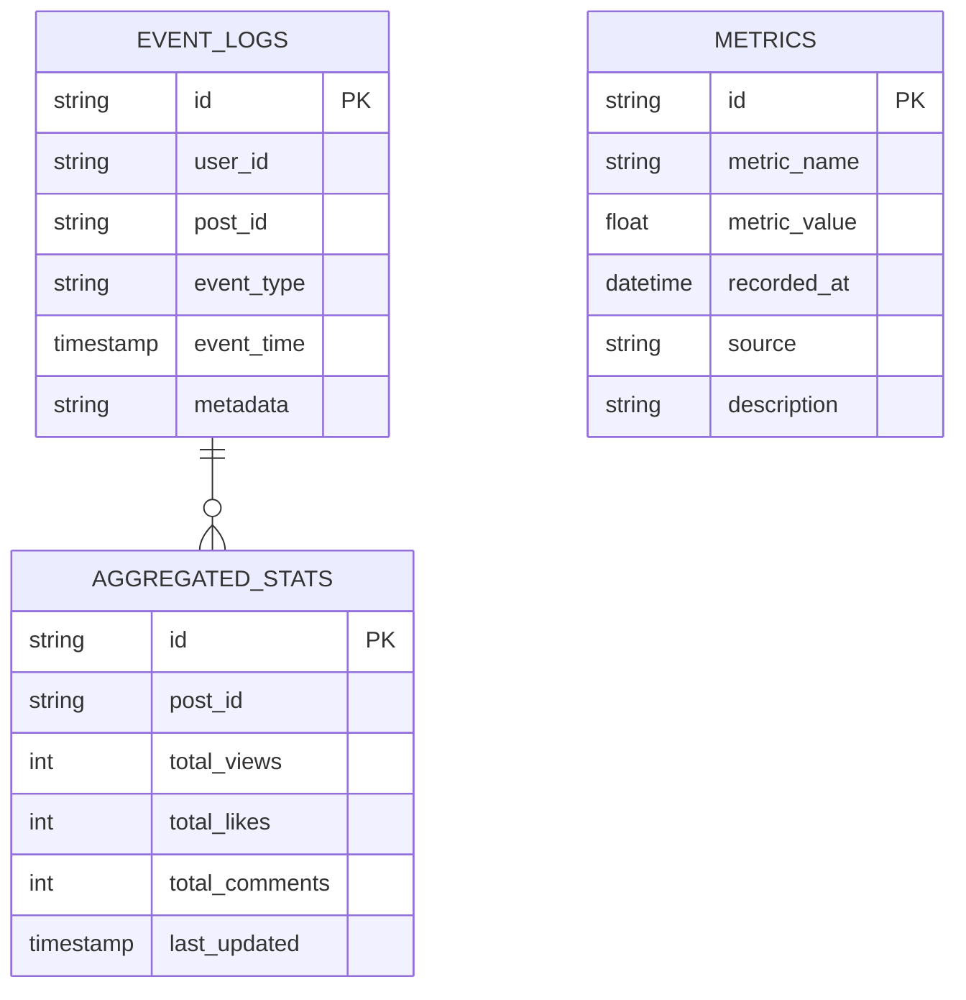

# Сервис аналитики

## Зона ответственности
Сервис аналитики отвечает за сбор, агрегацию и анализ данных о взаимодействии пользователей с системой. Он принимает события (просмотры, лайки, комментарии) из брокера сообщений, обрабатывает их и предоставляет аналитические отчёты для бизнес-пользователей и других сервисов.

## Основные задачи
- Сбор событий
- Хранение и анализ временных рядов данных по просмотрам, лайкам и комментариям.
- Предоставление API для получения аналитических отчётов 

## Границы сервиса
- Не обрабатывает данные о пользователях, постах или бизнес-аккаунтах
- Использует ClickHouse для хранения и обработки больших объёмов данных
- Работает исключительно с данными, поступающими от других сервисов, и не принимает прямые запросы от UI

## ER-диаграмма

