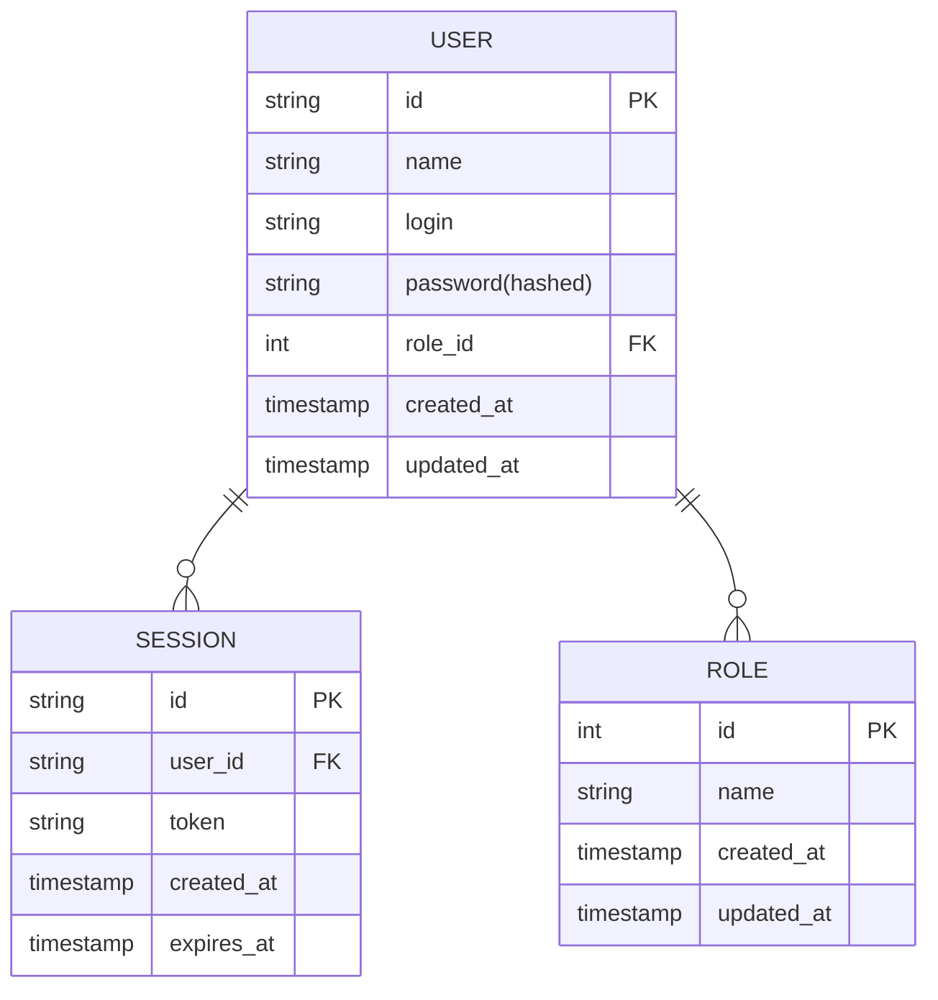

# Сервис пользователей

## Зона ответственности
Сервис пользователей отвечает за регистрацию, аутентификацию и управление учетными записями. Он хранит информацию о пользователях, их ролях, а также управляет сессиями

## Основные задачи
- Регистрация новых пользователей
- Аутентификация и авторизация
- Управление профилем и ролями пользователей
- Обработка сессий

## Границы сервиса
- Не отвечает за посты, комментарии или статистику

## ER-диаграмма

